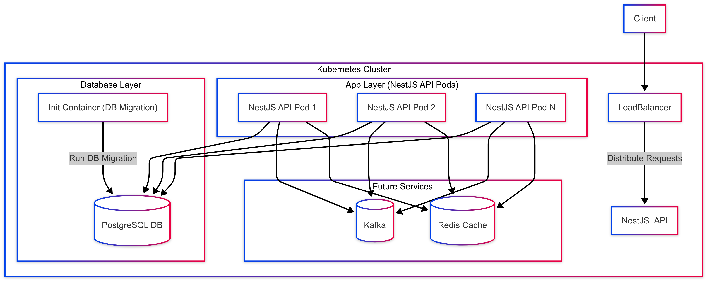

# Appointments System

This project is an appointment system built with NestJS, TypeORM, and TypeScript.  
This backend service will manage the creation, modification, and cancellation of appointments, handle availability checks, maintain provider schedules, and ensure proper system operation.


## Table of Contents

- [Architecture](#Architecture)
- [Deployment Infrastructure Notes](#Deployment-Infrastructure-Notes)
- [Components Implemented](#Components-Implemented)
- [Not Yet Implemented](#Not-Yet-Implemented)
- [Planned Enhancements](#Planned-Enhancements)
- [Installation](#Installation)
- [Environment Variables](#Environment-variables)
- [Migrations](#Migrations)
- [Time Handling & State](#Time-Handling--State)
- [Concurrency Control](#Concurrency-Control)
- [Events](#Events)
- [Scalability Considerations](#Scalability-Considerations)
- [Time Slot Generation](#Time-Slot-Generation)
- [Future Improvements](#Future-Improvements)
- [Assumptions](#Assumptions)
- [Known Issues](#Known-Issues)

# Architecture



# Deployment Infrastructure Notes

## Components Implemented

### Client → Load Balancer → Kubernetes Cluster
- Requests from clients are routed through a Load Balancer to a scalable set of NestJS API Pods.

### NestJS API Pods
- Deployed with horizontal scaling in mind.
- Each pod connects to a shared PostgreSQL database.

### Init Container
- Executes database migrations before the NestJS application starts.
- Ensures schema consistency on every deployment.

### PostgreSQL
- Centralized relational database for all app data.

### Optional Future Integrations
- Kafka for message-based communication/event streaming.
- Redis for caching layer and potential session management.

## Not Yet Implemented

### Database Clustering (Read/Write Replicas)
- PostgreSQL is currently deployed as a single instance with no replication strategy.
- This may lead to performance bottlenecks or availability risks under high read/write load.
- Future improvements should include:
   - Read replicas to distribute read operations.
   - A write master node with failover capabilities.
   - Consider tools like Patroni, pgpool-II, or managed HA PostgreSQL services.

## Planned Enhancements
- Replace mocked Event Emitters with a proper message queue system (e.g., Kafka).
- Implement Redis caching to optimize read-heavy operations.
- Add monitoring and alerting layers (e.g., Prometheus and Grafana) for observability.

## Notes 

1. I changed the provierId to uuid because i saw that using a string uuid in this case is not ideal because if i will design the provider it will be a uuid + a name.
2. I aimed for 70% code coverage for the tests due to time constraints.
3. I didnt use any indexes in the database because i saw that the data is not huge and i will not need it for now.
4. Error handling
   - The system uses a custom error handling mechanism to provide meaningful error messages and status codes.
   - This helps in debugging and provides a better user experience.
   - I prefer to add sentry or any other error tracking tool to track errors in production.
5. Database Migration
   - The system uses TypeORM migrations to manage database schema changes.
   - This allows for version control of the database schema and ensures that all instances of the application are using the same schema.
   - I added a script to generate the migrations automatically when you change the entities.
   
## Installation

1. Clone the repository:
    ```bash
    git clone git@github.com:sidhommoez/appointment-api.git
    cd appointment-api
    ```

2. Install the dependencies:
    ```bash
    npm install
    ```

3. Set up the database:
    - Create a `.env` file in the root directory and add your  configuration:
    - look example.env file

## Environment Variables

| Variable              | Description                                                                          |
|-----------------------|--------------------------------------------------------------------------------------|
| `HOST`                | The host address for the application.                                                |
| `CORS_ORIGIN`         | The allowed origin for CORS requests.                                                |
| `NODE_ENV`            | The environment in which the application is running (e.g., development, production). |
| `LOG_LEVEL`           | The level of logging (e.g., debug, info, warn).                                      |
| `INIT_CONTAINER`      | Flag to initialize the container.                                                    |
| `PORT`                | The port on which the application will run.                                          |
| `PSQL_HOST`           | The host address for the PostgreSQL database.                                        |
| `PSQL_PORT`           | The port for the PostgreSQL database.                                                |
| `PSQL_USERNAME`       | The username for the PostgreSQL database.                                            |
| `PSQL_PASSWORD`       | The password for the PostgreSQL database.                                            |
| `PSQL_DB`             | The name of the PostgreSQL database.                                                 |
| `PSQL_DROP_SCHEMA`    | Flag to drop the schema on startup.                                                  |
| `PSQL_MIGRATIONS_DIR` | The directory for database migrations.                                               |
| `PSQL_MIGRATION`      | Flag to run migrations on startup.                                                   |
| `PSQL_POOL_SIZE`      | The pool size for database connections.                                              |
| `DB_LOGGING`          | Flag to enable database logging.                                                     |
| `TZ`                  | The Default Timezone.                                                                |


## Usage

1. Start the application:
    ```bash
    npm run dev
    ```
   via docker (this will start the postgres db)
    ```bash
    docker-compose up -d
    ```

2. The application will be running at `http://localhost:3000`.

3. swagger documentation is available at `http://localhost:3000/docs`.

## Scripts 

Build: Builds the project using NestJS with tsc  
```bash
npm run build
```
Start: Starts the application  
```bash
npm run start
```
Dev: Starts the application in development mode with tsc and watch mode  
```bash
npm run dev
```
Lint: Runs ESLint to check for linting errors  
```bash
npm run lint
```
Lint Fix: Runs ESLint and automatically fixes linting errors  
```bash
npm run lint:fix
```
Test: Runs the tests using Vitest  
```bash
npm run test
```
Test Coverage: Runs the tests and generates a coverage report  
```bash
npm run test:cov
```

## Migrations

If you have changes to your entities, you can generate a migration:
Migration Run: Runs the database migrations
```bash
npm run migration:run <your-migration-name>
```

## Time Handling & State
- All stored time values are saved in UTC or timestamptz for consistency.

- Client-specified timezone is used only when displaying availability.

- Provider's working hours are converted from timezone → UTC → stored.

## Concurrency Control
- Booking logic is atomic and prevents double-booking.

- Uses database constraints and time-slot conflict filtering via queries.

- Time overlap detection is enforced during booking and rescheduling.

##  Events
- Events such as APPOINTMENT_CONFIRMED, APPOINTMENT_CANCELLED, and APPOINTMENT_RESCHEDULED are emitted via a mocked emitEvent() function.

##  Scalability Considerations
- Many Providers & Appointments: Indexed fields on providerId, startTime for fast lookup.

- All schedule queries are windowed by date and provider to keep index usage optimal.

- JSONB-based weeklySchedule allows flexible updates without complex joins.

##  Time Slot Generation
- Slots are computed on-demand, not precomputed/stored.

This ensures linear scalability with time range requested, not total bookings.

## Future Improvements

- Use of Redis locks or SELECT FOR UPDATE for stricter concurrency.

- Event queueing with Kafka/RabbitMQ instead of mock emitEvent().

- Partition tables for high-volume appointment storage (e.g., by month).

## Assumptions
- Appointments are 30 minutes by default (configurable).

- A provider's availability is defined by weekly recurring hours.

- Clients specify their timezone when requesting available slots.

- Booking, cancelling, or rescheduling emits an event immediately.

- No real user authentication (for simplicity).


## Known Issues

- The Timezone Header is working when you put valid timezone in the header or if you keep it empty it will take the default TZ which is set in the envs.
  but it is not working when you put a wrong timezone example 'im so wrong'. todo: fix the validation (i added this last min and decided to keep it).
